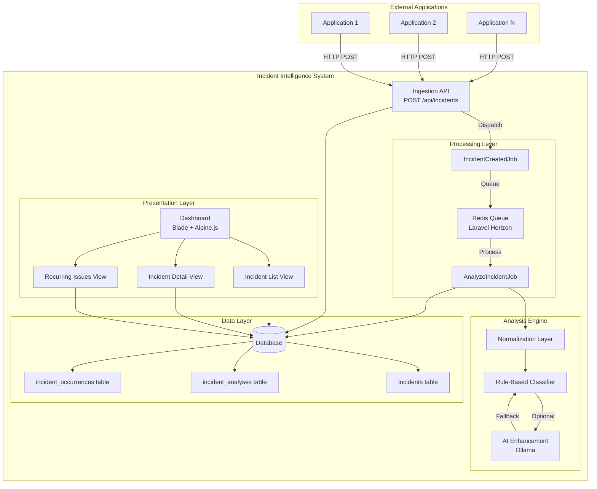
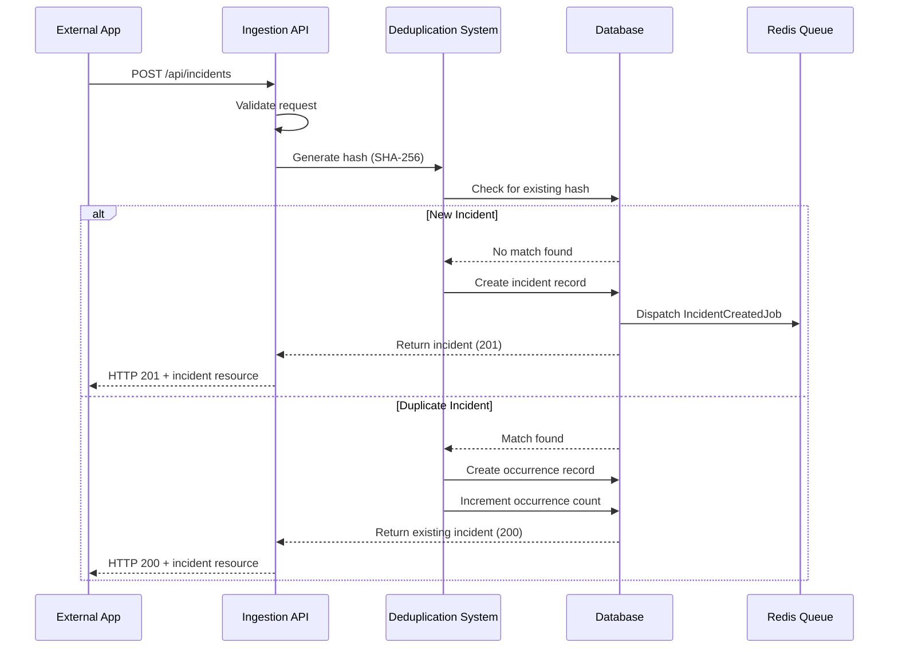
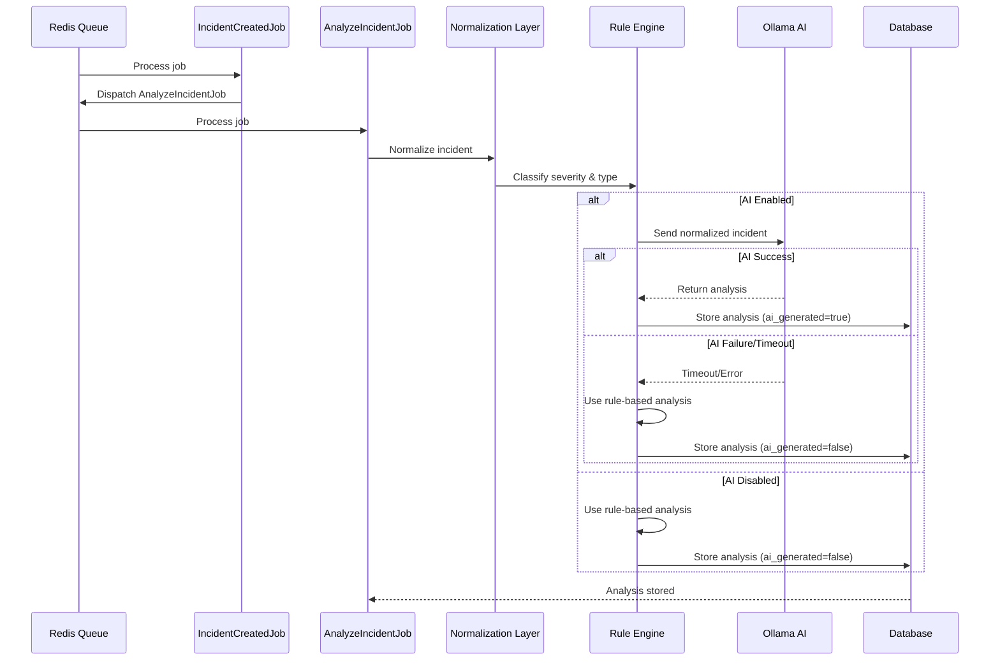
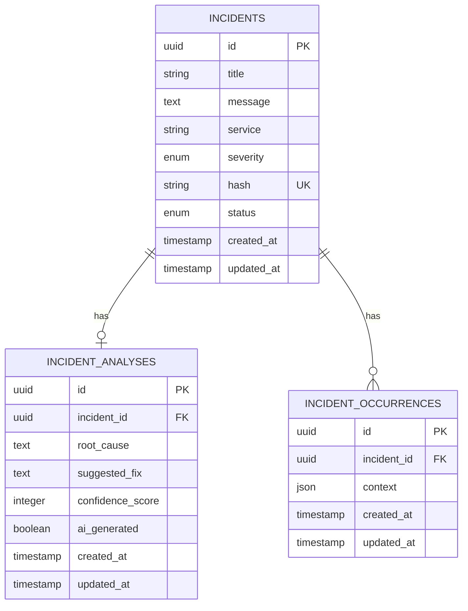

# Technical Design Document: Incident Intelligence System

## Overview

The Incident Intelligence System (IIS) is a standalone Laravel 12 application that provides intelligent error tracking and analysis. The system ingests errors and logs from external applications via a REST API, performs asynchronous analysis using a rule-based engine with optional AI enhancement, and presents actionable insights through a web dashboard.

### Core Capabilities

- **Incident Ingestion**: RESTful API endpoint for receiving errors and logs
- **Smart Deduplication**: Hash-based detection of recurring incidents
- **Automated Classification**: Rule-based severity and error type classification
- **Asynchronous Processing**: Queue-based architecture using Laravel Horizon
- **AI Enhancement**: Optional integration with Ollama (LLaMA 3/Mistral) for advanced analysis
- **Web Dashboard**: Blade + Alpine.js interface for incident management
- **Recurring Issue Detection**: Identification of systemic problems

### Technology Stack

- **Framework**: Laravel 12 (PHP 8.4)
- **Queue Management**: Laravel Horizon (Redis)
- **Database**: MySQL/PostgreSQL with UUID primary keys
- **Frontend**: Blade templates + Alpine.js 3 + Tailwind CSS 3
- **AI Integration**: Ollama (optional, local deployment)
- **Testing**: PHPUnit 11


## Architecture

### High-Level Architecture



### Request Flow

#### 1. Incident Ingestion Flow



#### 2. Analysis Flow



### Architectural Patterns

- **Repository Pattern**: Not used; leveraging Eloquent ORM directly per Laravel conventions
- **Service Layer**: Analysis logic encapsulated in dedicated service classes
- **Job-Based Processing**: Asynchronous processing using Laravel's queue system
- **API Resources**: Consistent API response formatting using Laravel API Resources
- **Form Requests**: Validation logic separated into dedicated Form Request classes


## Components and Interfaces

### API Layer

#### Controllers

**IncidentController** (`app/Http/Controllers/Api/IncidentController.php`)
- `store(StoreIncidentRequest $request)`: Create or update incident
- `index(Request $request)`: List incidents with filtering and pagination
- `show(Incident $incident)`: Show single incident with relationships
- `update(UpdateIncidentRequest $request, Incident $incident)`: Update incident status

**Form Requests**

**StoreIncidentRequest** (`app/Http/Requests/Api/StoreIncidentRequest.php`)
```php
public function rules(): array
{
    return [
        'service' => ['required', 'string', 'max:255'],
        'message' => ['required', 'string'],
        'context' => ['nullable', 'array'],
    ];
}
```

**UpdateIncidentRequest** (`app/Http/Requests/Api/UpdateIncidentRequest.php`)
```php
public function rules(): array
{
    return [
        'status' => ['required', 'in:open,investigating,resolved'],
    ];
}
```

#### API Resources

**IncidentResource** (`app/Http/Resources/IncidentResource.php`)
```php
public function toArray(Request $request): array
{
    return [
        'id' => $this->id,
        'title' => $this->title,
        'message' => $this->message,
        'service' => $this->service,
        'severity' => $this->severity,
        'status' => $this->status,
        'hash' => $this->hash,
        'occurrences_count' => $this->occurrences_count,
        'created_at' => $this->created_at,
        'updated_at' => $this->updated_at,
        'analysis' => new IncidentAnalysisResource($this->whenLoaded('analysis')),
        'occurrences' => IncidentOccurrenceResource::collection($this->whenLoaded('occurrences')),
    ];
}
```

**IncidentAnalysisResource** (`app/Http/Resources/IncidentAnalysisResource.php`)
```php
public function toArray(Request $request): array
{
    return [
        'id' => $this->id,
        'root_cause' => $this->root_cause,
        'suggested_fix' => $this->suggested_fix,
        'confidence_score' => $this->confidence_score,
        'ai_generated' => $this->ai_generated,
        'created_at' => $this->created_at,
    ];
}
```

**IncidentOccurrenceResource** (`app/Http/Resources/IncidentOccurrenceResource.php`)
```php
public function toArray(Request $request): array
{
    return [
        'id' => $this->id,
        'context' => $this->context,
        'created_at' => $this->created_at,
    ];
}
```

### Domain Layer

#### Models

**Incident** (`app/Models/Incident.php`)
```php
class Incident extends Model
{
    use HasUuids;
    
    protected $fillable = [
        'title',
        'message',
        'service',
        'severity',
        'hash',
        'status',
    ];
    
    protected function casts(): array
    {
        return [
            'severity' => SeverityEnum::class,
            'status' => StatusEnum::class,
        ];
    }
    
    public function analysis(): HasOne
    {
        return $this->hasOne(IncidentAnalysis::class);
    }
    
    public function occurrences(): HasMany
    {
        return $this->hasMany(IncidentOccurrence::class);
    }
    
    public function getOccurrencesCountAttribute(): int
    {
        return $this->occurrences()->count() + 1; // +1 for original
    }
}
```

**IncidentAnalysis** (`app/Models/IncidentAnalysis.php`)
```php
class IncidentAnalysis extends Model
{
    use HasUuids;
    
    protected $fillable = [
        'incident_id',
        'root_cause',
        'suggested_fix',
        'confidence_score',
        'ai_generated',
    ];
    
    protected function casts(): array
    {
        return [
            'confidence_score' => 'integer',
            'ai_generated' => 'boolean',
        ];
    }
    
    public function incident(): BelongsTo
    {
        return $this->belongsTo(Incident::class);
    }
}
```

**IncidentOccurrence** (`app/Models/IncidentOccurrence.php`)
```php
class Incident Occurrence extends Model
{
    use HasUuids;
    
    protected $fillable = [
        'incident_id',
        'context',
    ];
    
    protected function casts(): array
    {
        return [
            'context' => 'array',
        ];
    }
    
    public function incident(): BelongsTo
    {
        return $this->belongsTo(Incident::class);
    }
}
```

#### Enums

**SeverityEnum** (`app/Enums/SeverityEnum.php`)
```php
enum SeverityEnum: string
{
    case Low = 'low';
    case Medium = 'medium';
    case High = 'high';
    case Critical = 'critical';
}
```

**StatusEnum** (`app/Enums/StatusEnum.php`)
```php
enum StatusEnum: string
{
    case Open = 'open';
    case Investigating = 'investigating';
    case Resolved = 'resolved';
}
```

**ErrorTypeEnum** (`app/Enums/ErrorTypeEnum.php`)
```php
enum ErrorTypeEnum: string
{
    case DatabaseError = 'database_error';
    case NetworkError = 'network_error';
    case AuthError = 'auth_error';
    case PerformanceIssue = 'performance_issue';
    case Unknown = 'unknown';
}
```


### Service Layer

#### DeduplicationService

**DeduplicationService** (`app/Services/DeduplicationService.php`)

Handles hash generation and duplicate detection.

```php
class DeduplicationService
{
    public function generateHash(string $service, string $message): string
    {
        return hash('sha256', $service . $message);
    }
    
    public function findExistingIncident(string $hash): ?Incident
    {
        return Incident::where('hash', $hash)->first();
    }
    
    public function recordOccurrence(Incident $incident, ?array $context): IncidentOccurrence
    {
        return $incident->occurrences()->create([
            'context' => $context,
        ]);
    }
}
```

#### AnalysisService

**AnalysisService** (`app/Services/AnalysisService.php`)

Orchestrates the analysis process, coordinating between normalization, classification, and AI enhancement.

```php
class AnalysisService
{
    public function __construct(
        private NormalizationService $normalizer,
        private ClassificationService $classifier,
        private OllamaService $ollama,
    ) {}
    
    public function analyze(Incident $incident): IncidentAnalysis
    {
        $normalized = $this->normalizer->normalize($incident);
        $severity = $this->classifier->classifySeverity($normalized);
        $errorType = $this->classifier->classifyErrorType($normalized);
        
        // Update incident with classification
        $incident->update(['severity' => $severity]);
        
        // Generate analysis
        if (config('incident-intelligence.ai_enabled')) {
            try {
                return $this->generateAiAnalysis($incident, $normalized, $errorType);
            } catch (Exception $e) {
                Log::warning('AI analysis failed, falling back to rule-based', [
                    'incident_id' => $incident->id,
                    'error' => $e->getMessage(),
                ]);
            }
        }
        
        return $this->generateRuleBasedAnalysis($incident, $normalized, $errorType);
    }
    
    private function generateAiAnalysis(
        Incident $incident,
        string $normalized,
        ErrorTypeEnum $errorType
    ): IncidentAnalysis {
        $aiResponse = $this->ollama->analyze($normalized, $errorType);
        
        return $incident->analysis()->create([
            'root_cause' => $aiResponse['root_cause'],
            'suggested_fix' => $aiResponse['suggested_fix'],
            'confidence_score' => rand(80, 95),
            'ai_generated' => true,
        ]);
    }
    
    private function generateRuleBasedAnalysis(
        Incident $incident,
        string $normalized,
        ErrorTypeEnum $errorType
    ): IncidentAnalysis {
        $analysis = $this->classifier->generateAnalysis($normalized, $errorType);
        
        return $incident->analysis()->create([
            'root_cause' => $analysis['root_cause'],
            'suggested_fix' => $analysis['suggested_fix'],
            'confidence_score' => rand(60, 80),
            'ai_generated' => false,
        ]);
    }
}
```

#### NormalizationService

**NormalizationService** (`app/Services/NormalizationService.php`)

Strips noise and extracts error patterns from incident messages.

```php
class NormalizationService
{
    public function normalize(Incident $incident): string
    {
        $message = $incident->message;
        
        // Remove timestamps
        $message = preg_replace('/\d{4}-\d{2}-\d{2} \d{2}:\d{2}:\d{2}/', '', $message);
        
        // Remove file paths
        $message = preg_replace('/\/[^\s]+\.php/', '[FILE_PATH]', $message);
        
        // Remove line numbers
        $message = preg_replace('/:\d+/', '', $message);
        
        // Remove specific IDs and UUIDs
        $message = preg_replace('/[0-9a-f]{8}-[0-9a-f]{4}-[0-9a-f]{4}-[0-9a-f]{4}-[0-9a-f]{12}/', '[UUID]', $message);
        $message = preg_replace('/\b\d{5,}\b/', '[ID]', $message);
        
        // Normalize whitespace
        $message = preg_replace('/\s+/', ' ', $message);
        
        return trim($message);
    }
}
```

#### ClassificationService

**ClassificationService** (`app/Services/ClassificationService.php`)

Rule-based classification for severity and error types.

```php
class ClassificationService
{
    public function classifySeverity(string $normalizedMessage): SeverityEnum
    {
        $message = strtolower($normalizedMessage);
        
        // Critical patterns
        if (str_contains($message, 'sqlstate') ||
            str_contains($message, 'out of memory') ||
            str_contains($message, 'memory exhausted')) {
            return SeverityEnum::Critical;
        }
        
        // High patterns
        if (str_contains($message, 'timeout') ||
            str_contains($message, 'connection refused') ||
            str_contains($message, 'connection failed')) {
            return SeverityEnum::High;
        }
        
        // Low patterns
        if (str_contains($message, 'deprecated')) {
            return SeverityEnum::Low;
        }
        
        // Medium patterns (including auth)
        if (str_contains($message, 'unauthorized') ||
            str_contains($message, 'forbidden')) {
            return SeverityEnum::Medium;
        }
        
        // Default
        return SeverityEnum::Medium;
    }
    
    public function classifyErrorType(string $normalizedMessage): ErrorTypeEnum
    {
        $message = strtolower($normalizedMessage);
        
        if (str_contains($message, 'sqlstate') ||
            str_contains($message, 'database') ||
            str_contains($message, 'query')) {
            return ErrorTypeEnum::DatabaseError;
        }
        
        if (str_contains($message, 'connection') ||
            str_contains($message, 'timeout') ||
            str_contains($message, 'network')) {
            return ErrorTypeEnum::NetworkError;
        }
        
        if (str_contains($message, 'unauthorized') ||
            str_contains($message, 'forbidden') ||
            str_contains($message, 'authentication')) {
            return ErrorTypeEnum::AuthError;
        }
        
        if (str_contains($message, 'memory') ||
            str_contains($message, 'slow') ||
            str_contains($message, 'performance')) {
            return ErrorTypeEnum::PerformanceIssue;
        }
        
        return ErrorTypeEnum::Unknown;
    }
    
    public function generateAnalysis(string $normalized, ErrorTypeEnum $errorType): array
    {
        return match ($errorType) {
            ErrorTypeEnum::DatabaseError => [
                'root_cause' => 'Database query error or connection issue detected.',
                'suggested_fix' => 'Check database connection settings, verify query syntax, and ensure database server is accessible.',
            ],
            ErrorTypeEnum::NetworkError => [
                'root_cause' => 'Network connectivity issue or timeout detected.',
                'suggested_fix' => 'Verify network connectivity, check firewall rules, and increase timeout settings if necessary.',
            ],
            ErrorTypeEnum::AuthError => [
                'root_cause' => 'Authentication or authorization failure detected.',
                'suggested_fix' => 'Verify user credentials, check permission settings, and ensure authentication tokens are valid.',
            ],
            ErrorTypeEnum::PerformanceIssue => [
                'root_cause' => 'Performance degradation or resource exhaustion detected.',
                'suggested_fix' => 'Optimize resource usage, increase memory limits, and review performance bottlenecks.',
            ],
            ErrorTypeEnum::Unknown => [
                'root_cause' => 'Unable to determine specific error type from the incident message.',
                'suggested_fix' => 'Review the full error message and context for more details.',
            ],
        };
    }
}
```

#### OllamaService

**OllamaService** (`app/Services/OllamaService.php`)

Handles communication with Ollama AI service.

```php
class OllamaService
{
    public function __construct(
        private HttpClient $http,
    ) {}
    
    public function analyze(string $normalizedMessage, ErrorTypeEnum $errorType): array
    {
        $url = config('incident-intelligence.ollama_url') . '/api/generate';
        $model = config('incident-intelligence.ollama_model');
        $timeout = config('incident-intelligence.ollama_timeout');
        
        $prompt = $this->buildPrompt($normalizedMessage, $errorType);
        
        $response = $this->http->timeout($timeout)->post($url, [
            'model' => $model,
            'prompt' => $prompt,
            'stream' => false,
        ]);
        
        if (!$response->successful()) {
            throw new Exception('Ollama request failed: ' . $response->body());
        }
        
        return $this->parseResponse($response->json());
    }
    
    private function buildPrompt(string $message, ErrorTypeEnum $errorType): string
    {
        return <<<PROMPT
        You are an expert software engineer analyzing an error message.
        
        Error Type: {$errorType->value}
        Error Message: {$message}
        
        Provide a concise analysis in the following format:
        ROOT_CAUSE: [One sentence explaining the root cause]
        SUGGESTED_FIX: [One sentence with actionable fix]
        PROMPT;
    }
    
    private function parseResponse(array $response): array
    {
        $text = $response['response'] ?? '';
        
        preg_match('/ROOT_CAUSE:\s*(.+?)(?=SUGGESTED_FIX:|$)/s', $text, $rootCauseMatch);
        preg_match('/SUGGESTED_FIX:\s*(.+?)$/s', $text, $suggestedFixMatch);
        
        return [
            'root_cause' => trim($rootCauseMatch[1] ?? 'Unable to determine root cause'),
            'suggested_fix' => trim($suggestedFixMatch[1] ?? 'Manual investigation required'),
        ];
    }
}
```


### Queue Jobs

#### IncidentCreatedJob

**IncidentCreatedJob** (`app/Jobs/IncidentCreatedJob.php`)

Dispatched immediately after incident creation to trigger analysis.

```php
class IncidentCreatedJob implements ShouldQueue
{
    use Dispatchable, InteractsWithQueue, Queueable, SerializesModels;
    
    public int $tries = 3;
    public int $backoff = 60; // Exponential backoff starting at 60 seconds
    
    public function __construct(
        public Incident $incident,
    ) {}
    
    public function handle(): void
    {
        // Dispatch analysis job
        AnalyzeIncidentJob::dispatch($this->incident)
            ->onQueue(config('incident-intelligence.queue_connection'));
    }
    
    public function failed(?Throwable $exception): void
    {
        Log::error('IncidentCreatedJob failed', [
            'incident_id' => $this->incident->id,
            'error' => $exception?->getMessage(),
        ]);
    }
}
```

#### AnalyzeIncidentJob

**AnalyzeIncidentJob** (`app/Jobs/AnalyzeIncidentJob.php`)

Performs the actual incident analysis using the AnalysisService.

```php
class AnalyzeIncidentJob implements ShouldQueue
{
    use Dispatchable, InteractsWithQueue, Queueable, SerializesModels;
    
    public int $tries = 3;
    public int $backoff = 60;
    public int $timeout = 35; // Slightly longer than Ollama timeout
    
    public function __construct(
        public Incident $incident,
    ) {}
    
    public function handle(AnalysisService $analysisService): void
    {
        // Skip if already analyzed
        if ($this->incident->analysis()->exists()) {
            return;
        }
        
        $analysisService->analyze($this->incident);
    }
    
    public function failed(?Throwable $exception): void
    {
        Log::error('AnalyzeIncidentJob failed', [
            'incident_id' => $this->incident->id,
            'error' => $exception?->getMessage(),
        ]);
        
        // Ensure incident remains in open status
        $this->incident->update(['status' => StatusEnum::Open]);
    }
}
```

### Dashboard Layer

#### Controllers

**DashboardController** (`app/Http/Controllers/DashboardController.php`)

```php
class DashboardController extends Controller
{
    public function index(Request $request)
    {
        $query = Incident::query()
            ->with(['analysis', 'occurrences'])
            ->withCount('occurrences');
        
        // Apply filters
        if ($request->filled('service')) {
            $query->where('service', $request->service);
        }
        
        if ($request->filled('severity')) {
            $query->where('severity', $request->severity);
        }
        
        if ($request->filled('status')) {
            $query->where('status', $request->status);
        }
        
        $incidents = $query->latest()->paginate(25);
        
        return view('dashboard.index', [
            'incidents' => $incidents,
            'services' => Incident::distinct()->pluck('service'),
        ]);
    }
    
    public function show(Incident $incident)
    {
        $incident->load(['analysis', 'occurrences' => fn($q) => $q->latest()]);
        
        return view('dashboard.show', [
            'incident' => $incident,
        ]);
    }
    
    public function recurring(Request $request)
    {
        $query = Incident::query()
            ->with('analysis')
            ->withCount('occurrences')
            ->having('occurrences_count', '>=', 1); // 1+ occurrences means 2+ total
        
        if ($request->filled('service')) {
            $query->where('service', $request->service);
        }
        
        if ($request->filled('severity')) {
            $query->where('severity', $request->severity);
        }
        
        $incidents = $query->orderByDesc('occurrences_count')->paginate(25);
        
        return view('dashboard.recurring', [
            'incidents' => $incidents,
            'services' => Incident::distinct()->pluck('service'),
        ]);
    }
}
```

#### Views Structure

**Layout** (`resources/views/layouts/app.blade.php`)
- Base layout with Tailwind CSS and Alpine.js
- Navigation menu
- Flash message display

**Dashboard Index** (`resources/views/dashboard/index.blade.php`)
- Paginated incident list
- Filter controls (service, severity, status)
- Severity badges with color coding
- Quick status indicators

**Incident Detail** (`resources/views/dashboard/show.blade.php`)
- Full incident information
- Analysis section with confidence score
- Occurrences timeline
- Status update form

**Recurring Issues** (`resources/views/dashboard/recurring.blade.php`)
- Incidents sorted by occurrence count
- First and last occurrence timestamps
- Filter controls

#### Alpine.js Components

**Filter Component** (inline in views)
```javascript
Alpine.data('incidentFilters', () => ({
    service: '',
    severity: '',
    status: '',
    
    applyFilters() {
        const params = new URLSearchParams();
        if (this.service) params.set('service', this.service);
        if (this.severity) params.set('severity', this.severity);
        if (this.status) params.set('status', this.status);
        
        window.location.search = params.toString();
    },
    
    clearFilters() {
        this.service = '';
        this.severity = '';
        this.status = '';
        window.location.search = '';
    }
}))
```

**Status Update Component** (inline in detail view)
```javascript
Alpine.data('statusUpdate', (incidentId, currentStatus) => ({
    status: currentStatus,
    updating: false,
    
    async updateStatus() {
        this.updating = true;
        
        try {
            const response = await fetch(`/api/incidents/${incidentId}`, {
                method: 'PATCH',
                headers: {
                    'Content-Type': 'application/json',
                    'X-CSRF-TOKEN': document.querySelector('meta[name="csrf-token"]').content,
                },
                body: JSON.stringify({ status: this.status }),
            });
            
            if (response.ok) {
                window.location.reload();
            }
        } catch (error) {
            console.error('Failed to update status:', error);
        } finally {
            this.updating = false;
        }
    }
}))
```


## Data Models

### Database Schema

#### Incidents Table

```php
Schema::create('incidents', function (Blueprint $table) {
    $table->uuid('id')->primary();
    $table->string('title');
    $table->text('message');
    $table->string('service')->index();
    $table->enum('severity', ['low', 'medium', 'high', 'critical'])->index();
    $table->string('hash', 64)->unique();
    $table->enum('status', ['open', 'investigating', 'resolved'])->index()->default('open');
    $table->timestamps();
    
    $table->index('created_at');
});
```

**Columns:**
- `id`: UUID primary key
- `title`: Auto-generated short title (first 100 chars of message)
- `message`: Full error message (text)
- `service`: Application component identifier (indexed for filtering)
- `severity`: Enum (low, medium, high, critical) - indexed for filtering
- `hash`: SHA-256 hash of service + message (unique index for deduplication)
- `status`: Enum (open, investigating, resolved) - indexed for filtering
- `created_at`, `updated_at`: Timestamps (created_at indexed for sorting)

#### Incident Analyses Table

```php
Schema::create('incident_analyses', function (Blueprint $table) {
    $table->uuid('id')->primary();
    $table->foreignUuid('incident_id')->constrained()->onDelete('cascade');
    $table->text('root_cause');
    $table->text('suggested_fix');
    $table->integer('confidence_score'); // 0-100
    $table->boolean('ai_generated')->default(false);
    $table->timestamps();
    
    $table->index('incident_id');
});
```

**Columns:**
- `id`: UUID primary key
- `incident_id`: Foreign key to incidents table (cascade delete)
- `root_cause`: Analysis of what caused the error (text)
- `suggested_fix`: Recommended solution (text)
- `confidence_score`: Integer 0-100 indicating analysis reliability
- `ai_generated`: Boolean flag indicating if AI was used
- `created_at`, `updated_at`: Timestamps

#### Incident Occurrences Table

```php
Schema::create('incident_occurrences', function (Blueprint $table) {
    $table->uuid('id')->primary();
    $table->foreignUuid('incident_id')->constrained()->onDelete('cascade');
    $table->json('context')->nullable();
    $table->timestamps();
    
    $table->index('incident_id');
    $table->index('created_at');
});
```

**Columns:**
- `id`: UUID primary key
- `incident_id`: Foreign key to incidents table (cascade delete)
- `context`: JSON field storing additional metadata from duplicate submission
- `created_at`, `updated_at`: Timestamps (created_at indexed for timeline queries)

### Entity Relationships



### Factories

**IncidentFactory** (`database/factories/IncidentFactory.php`)
```php
public function definition(): array
{
    return [
        'title' => fake()->sentence(),
        'message' => fake()->paragraph(),
        'service' => fake()->randomElement(['auth', 'payments', 'api', 'notifications']),
        'severity' => fake()->randomElement(['low', 'medium', 'high', 'critical']),
        'hash' => hash('sha256', fake()->unique()->uuid()),
        'status' => fake()->randomElement(['open', 'investigating', 'resolved']),
    ];
}

public function critical(): static
{
    return $this->state(fn (array $attributes) => [
        'severity' => 'critical',
    ]);
}

public function resolved(): static
{
    return $this->state(fn (array $attributes) => [
        'status' => 'resolved',
    ]);
}
```

**IncidentAnalysisFactory** (`database/factories/IncidentAnalysisFactory.php`)
```php
public function definition(): array
{
    return [
        'incident_id' => Incident::factory(),
        'root_cause' => fake()->sentence(),
        'suggested_fix' => fake()->sentence(),
        'confidence_score' => fake()->numberBetween(60, 95),
        'ai_generated' => fake()->boolean(),
    ];
}

public function aiGenerated(): static
{
    return $this->state(fn (array $attributes) => [
        'ai_generated' => true,
        'confidence_score' => fake()->numberBetween(80, 95),
    ]);
}

public function ruleBased(): static
{
    return $this->state(fn (array $attributes) => [
        'ai_generated' => false,
        'confidence_score' => fake()->numberBetween(60, 80),
    ]);
}
```

**IncidentOccurrenceFactory** (`database/factories/IncidentOccurrenceFactory.php`)
```php
public function definition(): array
{
    return [
        'incident_id' => Incident::factory(),
        'context' => [
            'user_id' => fake()->uuid(),
            'ip_address' => fake()->ipv4(),
            'user_agent' => fake()->userAgent(),
        ],
    ];
}
```

### Routing

**API Routes** (`routes/api.php`)
```php
Route::prefix('incidents')->group(function () {
    Route::post('/', [IncidentController::class, 'store']);
    Route::get('/', [IncidentController::class, 'index']);
    Route::get('/{incident}', [IncidentController::class, 'show']);
    Route::patch('/{incident}', [IncidentController::class, 'update']);
});
```

**Web Routes** (`routes/web.php`)
```php
Route::get('/', [DashboardController::class, 'index'])->name('dashboard.index');
Route::get('/incidents/{incident}', [DashboardController::class, 'show'])->name('dashboard.show');
Route::get('/recurring', [DashboardController::class, 'recurring'])->name('dashboard.recurring');
```

### Configuration

**Config File** (`config/incident-intelligence.php`)
```php
return [
    /*
    |--------------------------------------------------------------------------
    | AI Enhancement
    |--------------------------------------------------------------------------
    |
    | Enable or disable AI-powered analysis using Ollama.
    |
    */
    'ai_enabled' => env('INCIDENT_AI_ENABLED', false),
    
    /*
    |--------------------------------------------------------------------------
    | Ollama Configuration
    |--------------------------------------------------------------------------
    |
    | Configuration for Ollama AI service integration.
    |
    */
    'ollama_url' => env('INCIDENT_OLLAMA_URL', 'http://localhost:11434'),
    'ollama_model' => env('INCIDENT_OLLAMA_MODEL', 'llama3'),
    'ollama_timeout' => env('INCIDENT_OLLAMA_TIMEOUT', 25),
    
    /*
    |--------------------------------------------------------------------------
    | Queue Configuration
    |--------------------------------------------------------------------------
    |
    | Queue connection and retry settings for incident processing.
    |
    */
    'queue_connection' => env('INCIDENT_QUEUE_CONNECTION', 'redis'),
    'analysis_retry_attempts' => env('INCIDENT_ANALYSIS_RETRY_ATTEMPTS', 3),
];
```

**Environment Variables** (`.env.example`)
```env
# Incident Intelligence System
INCIDENT_AI_ENABLED=false
INCIDENT_OLLAMA_URL=http://localhost:11434
INCIDENT_OLLAMA_MODEL=llama3
INCIDENT_OLLAMA_TIMEOUT=25
INCIDENT_QUEUE_CONNECTION=redis
INCIDENT_ANALYSIS_RETRY_ATTEMPTS=3
```


## Correctness Properties

A property is a characteristic or behavior that should hold true across all valid executions of a system—essentially, a formal statement about what the system should do. Properties serve as the bridge between human-readable specifications and machine-verifiable correctness guarantees.

### Property 1: Valid incident submission returns 201

For any incident submission with valid service, message, and context fields, the API should return HTTP 201 with a complete incident resource containing id, title, message, service, severity, status, hash, and timestamps.

**Validates: Requirements 1.3, 11.1**

### Property 2: Invalid incident submission returns 422

For any incident submission missing required fields (service or message), the API should return HTTP 422 with validation errors in the response.

**Validates: Requirements 1.4, 11.5**

### Property 3: Created incidents have UUID and timestamps

For any created incident, the stored record should have a valid UUID as the primary key and both created_at and updated_at timestamps populated.

**Validates: Requirements 1.8, 1.9**

### Property 4: Hash generation is deterministic

For any service and message combination, generating the hash multiple times should always produce the same SHA-256 hash value.

**Validates: Requirements 2.1**

### Property 5: Duplicate submission creates occurrence, not new incident

For any incident that already exists (matching hash), submitting it again should create a new incident_occurrence record, increment the occurrence count, and return HTTP 200 with the existing incident resource, not create a new incident.

**Validates: Requirements 2.2, 2.3, 2.5**

### Property 6: Occurrence records contain required fields

For any created incident_occurrence record, it should contain incident_id, context (JSON), and created_at timestamp.

**Validates: Requirements 2.4**

### Property 7: All incidents have valid severity classification

For any created incident, the severity field should be one of the four valid enum values: low, medium, high, or critical.

**Validates: Requirements 3.1, 3.9**

### Property 8: Severity classification is deterministic

For any incident message, classifying the severity multiple times should always produce the same severity level.

**Validates: Requirements 3.2-3.8**

### Property 9: All incidents have valid error type classification

For any analyzed incident, the error type should be one of the valid enum values: database_error, network_error, auth_error, performance_issue, or unknown.

**Validates: Requirements 5.2**

### Property 10: Incident creation dispatches queue job

For any created incident, an IncidentCreatedJob should be dispatched to the configured queue connection.

**Validates: Requirements 4.1**

### Property 11: IncidentCreatedJob dispatches AnalyzeIncidentJob

For any processed IncidentCreatedJob, an AnalyzeIncidentJob should be dispatched to the queue.

**Validates: Requirements 4.2**

### Property 12: Normalization is idempotent

For any incident, normalizing the message once and normalizing it twice should produce the same result (normalization is idempotent).

**Validates: Requirements 5.1**

### Property 13: All analyses have required fields

For any created incident_analysis record, it should contain incident_id, root_cause, suggested_fix, confidence_score (0-100), and ai_generated flag.

**Validates: Requirements 5.3, 5.4, 5.5, 5.6**

### Property 14: Confidence score is within valid range

For any incident analysis, the confidence_score should be an integer between 0 and 100 (inclusive).

**Validates: Requirements 5.7**

### Property 15: New incidents default to open status

For any newly created incident, the status field should be set to 'open' by default.

**Validates: Requirements 7.1**

### Property 16: Status updates only accept valid enum values

For any incident status update request, only the valid enum values (open, investigating, resolved) should be accepted; invalid values should return HTTP 422.

**Validates: Requirements 7.3**

### Property 17: Status updates modify updated_at timestamp

For any incident status update, the updated_at timestamp should be modified to reflect the current time.

**Validates: Requirements 7.4**

### Property 18: All incidents have valid status

For any incident in the database, the status field should be one of the three valid enum values: open, investigating, or resolved.

**Validates: Requirements 7.2**

### Property 19: API responses include required relationships

For any incident retrieved via API, when relationships are loaded, the response should include the analysis object (with root_cause, suggested_fix, confidence_score, ai_generated) and occurrences_count attribute.

**Validates: Requirements 11.2, 11.3**

### Property 20: Paginated responses have correct structure

For any incident list request, the paginated response should contain data array, links object, and meta object with pagination information.

**Validates: Requirements 11.4**

### Property 21: Error responses have consistent format

For any API error (validation, server error, etc.), the response should contain a message field and, where applicable, an errors field with detailed error information.

**Validates: Requirements 11.5**

### Property 22: Analysis errors are logged with context

For any error that occurs during incident analysis, the error should be logged to Laravel log files with contextual information (incident_id, error message).

**Validates: Requirements 13.6**

### Property 23: Error responses do not expose sensitive information

For any error response from the API, the response body should not contain sensitive information such as database credentials, internal file paths, or stack traces in production.

**Validates: Requirements 13.7**


## Error Handling

### API Layer Error Handling

#### Validation Errors (HTTP 422)
- Missing required fields (service, message)
- Invalid data types
- Invalid enum values (severity, status)
- Malformed JSON payloads

**Response Format:**
```json
{
    "message": "The given data was invalid.",
    "errors": {
        "service": ["The service field is required."],
        "message": ["The message field is required."]
    }
}
```

#### Malformed JSON (HTTP 400)
- Invalid JSON syntax
- Unparseable request body

**Response Format:**
```json
{
    "message": "Invalid JSON payload."
}
```

#### Server Errors (HTTP 500)
- Database connection failures
- Unexpected exceptions
- System errors

**Response Format:**
```json
{
    "message": "An error occurred while processing your request."
}
```

**Security Note:** Generic error messages in production; detailed errors only in development/testing environments.

### Queue Job Error Handling

#### Retry Strategy
- **Attempts**: 3 retries per job
- **Backoff**: Exponential backoff starting at 60 seconds (60s, 120s, 240s)
- **Timeout**: 35 seconds for AnalyzeIncidentJob (allows for Ollama timeout + processing)

#### Failed Job Handling
```php
public function failed(?Throwable $exception): void
{
    Log::error('Job failed', [
        'job' => static::class,
        'incident_id' => $this->incident->id,
        'error' => $exception?->getMessage(),
        'trace' => $exception?->getTraceAsString(),
    ]);
    
    // Ensure incident remains accessible
    $this->incident->update(['status' => StatusEnum::Open]);
}
```

### AI Service Error Handling

#### Ollama Unavailable
- **Detection**: Connection refused, timeout, or HTTP error
- **Action**: Log warning and fall back to rule-based analysis
- **User Impact**: None (transparent fallback)

```php
try {
    return $this->generateAiAnalysis($incident, $normalized, $errorType);
} catch (ConnectionException | TimeoutException $e) {
    Log::warning('Ollama unavailable, using rule-based analysis', [
        'incident_id' => $incident->id,
        'error' => $e->getMessage(),
    ]);
    return $this->generateRuleBasedAnalysis($incident, $normalized, $errorType);
}
```

#### Ollama Timeout
- **Timeout**: 25 seconds
- **Action**: Cancel request and fall back to rule-based analysis
- **Logging**: Warning level with incident context

### Database Error Handling

#### Constraint Violations
- **Unique Hash Violation**: Indicates race condition; handle as duplicate
- **Foreign Key Violations**: Log error and return 500
- **Enum Violations**: Caught by validation layer

#### Connection Failures
- **Action**: Return HTTP 500 with generic message
- **Logging**: Error level with full exception details
- **Retry**: Automatic retry via queue system for background jobs

### Logging Strategy

#### Log Levels
- **Error**: Database failures, job failures after all retries, unexpected exceptions
- **Warning**: AI service unavailable, timeout events, recoverable errors
- **Info**: Incident created, analysis completed, status changes
- **Debug**: Normalization results, classification decisions (development only)

#### Log Context
All logs include:
- `incident_id`: UUID of the incident
- `service`: Application component
- `severity`: Classified severity level
- `timestamp`: ISO 8601 timestamp
- `error`: Exception message (for errors)

#### Log Channels
- **Default**: `storage/logs/laravel.log`
- **Queue**: Horizon dashboard + default log
- **API**: Default log with request context


## Testing Strategy

### Dual Testing Approach

The Incident Intelligence System requires both unit/feature tests and property-based tests for comprehensive coverage:

- **Unit/Feature Tests**: Verify specific examples, edge cases, error conditions, and integration points
- **Property-Based Tests**: Verify universal properties across all inputs using randomized test data

Both approaches are complementary and necessary. Unit tests catch concrete bugs and verify specific scenarios, while property tests verify general correctness across a wide range of inputs.

### Property-Based Testing Configuration

**Library**: Use a PHP property-based testing library compatible with PHPUnit 11
- Recommended: Custom implementation using PHPUnit data providers with randomized data
- Alternative: Eris (if compatible with PHP 8.4 and PHPUnit 11)

**Configuration**:
- Minimum 100 iterations per property test
- Each property test must reference its design document property
- Tag format: `@test Feature: incident-intelligence-system, Property {number}: {property_text}`

**Example Property Test Structure**:
```php
/**
 * @test
 * Feature: incident-intelligence-system, Property 4: Hash generation is deterministic
 */
public function test_hash_generation_is_deterministic(): void
{
    $service = new DeduplicationService();
    
    for ($i = 0; $i < 100; $i++) {
        $serviceName = fake()->word();
        $message = fake()->sentence();
        
        $hash1 = $service->generateHash($serviceName, $message);
        $hash2 = $service->generateHash($serviceName, $message);
        
        $this->assertEquals($hash1, $hash2);
    }
}
```

### Unit Test Coverage

#### API Layer Tests (`tests/Feature/Api/IncidentControllerTest.php`)

**Happy Path**:
- `test_can_create_incident_with_valid_data()` - Validates Requirements 1.3
- `test_can_list_incidents_with_pagination()` - Validates Requirements 11.4
- `test_can_show_single_incident_with_relationships()` - Validates Requirements 11.2, 11.3
- `test_can_update_incident_status()` - Validates Requirements 7.3, 7.4

**Validation Errors**:
- `test_cannot_create_incident_without_service()` - Validates Requirements 1.2, 1.4
- `test_cannot_create_incident_without_message()` - Validates Requirements 1.2, 1.4
- `test_cannot_update_incident_with_invalid_status()` - Validates Requirements 7.3
- `test_returns_400_for_malformed_json()` - Validates Requirements 13.1

**Edge Cases**:
- `test_handles_empty_context_field()` - Context is optional
- `test_handles_very_long_error_messages()` - Text field limits
- `test_filters_incidents_by_service()` - Query filtering
- `test_filters_incidents_by_severity()` - Query filtering
- `test_filters_incidents_by_status()` - Query filtering

#### Deduplication Tests (`tests/Feature/DeduplicationTest.php`)

**Happy Path**:
- `test_creates_new_incident_for_unique_hash()` - Validates Requirements 2.1
- `test_creates_occurrence_for_duplicate_hash()` - Validates Requirements 2.2, 2.3
- `test_returns_200_for_duplicate_incident()` - Validates Requirements 2.5
- `test_occurrence_contains_context_and_timestamp()` - Validates Requirements 2.4

**Edge Cases**:
- `test_handles_concurrent_duplicate_submissions()` - Race condition handling
- `test_unique_constraint_on_hash_column()` - Validates Requirements 2.6

#### Classification Tests (`tests/Unit/ClassificationServiceTest.php`)

**Severity Classification**:
- `test_classifies_sqlstate_as_critical()` - Validates Requirements 3.2
- `test_classifies_memory_exhausted_as_critical()` - Validates Requirements 3.6
- `test_classifies_timeout_as_high()` - Validates Requirements 3.3
- `test_classifies_connection_refused_as_high()` - Validates Requirements 3.5
- `test_classifies_unauthorized_as_medium()` - Validates Requirements 3.7
- `test_classifies_deprecated_as_low()` - Validates Requirements 3.4
- `test_defaults_to_medium_severity()` - Validates Requirements 3.8

**Error Type Classification**:
- `test_classifies_database_errors()` - Validates Requirements 5.2
- `test_classifies_network_errors()` - Validates Requirements 5.2
- `test_classifies_auth_errors()` - Validates Requirements 5.2
- `test_classifies_performance_issues()` - Validates Requirements 5.2
- `test_defaults_to_unknown_type()` - Validates Requirements 5.2

#### Normalization Tests (`tests/Unit/NormalizationServiceTest.php`)

**Happy Path**:
- `test_removes_timestamps_from_message()` - Validates Requirements 5.1
- `test_removes_file_paths_from_message()` - Validates Requirements 5.1
- `test_removes_line_numbers_from_message()` - Validates Requirements 5.1
- `test_removes_uuids_from_message()` - Validates Requirements 5.1
- `test_normalizes_whitespace()` - Validates Requirements 5.1

**Property Test**:
- `test_normalization_is_idempotent()` - Validates Requirements 5.1 (Property 12)

#### Queue Job Tests (`tests/Feature/QueueJobTest.php`)

**Happy Path**:
- `test_incident_created_job_dispatches_analyze_job()` - Validates Requirements 4.1, 4.2
- `test_analyze_job_creates_analysis_record()` - Validates Requirements 5.5
- `test_analyze_job_skips_already_analyzed_incidents()` - Idempotency

**Error Handling**:
- `test_failed_job_retries_three_times()` - Validates Requirements 4.4
- `test_failed_job_logs_error_after_retries()` - Validates Requirements 4.5, 13.3
- `test_failed_job_keeps_incident_status_open()` - Validates Requirements 13.5

#### Analysis Service Tests (`tests/Unit/AnalysisServiceTest.php`)

**Rule-Based Analysis**:
- `test_generates_rule_based_analysis_when_ai_disabled()` - Validates Requirements 5.8, 5.9
- `test_rule_based_analysis_has_confidence_60_to_80()` - Validates Requirements 5.9
- `test_rule_based_analysis_sets_ai_generated_false()` - Validates Requirements 5.8

**AI Enhancement** (with mocked Ollama):
- `test_generates_ai_analysis_when_enabled()` - Validates Requirements 6.1, 6.2
- `test_ai_analysis_has_confidence_80_to_95()` - Validates Requirements 6.4
- `test_ai_analysis_sets_ai_generated_true()` - Validates Requirements 6.3
- `test_falls_back_to_rules_when_ollama_unavailable()` - Validates Requirements 6.5, 13.4
- `test_falls_back_to_rules_when_ollama_times_out()` - Validates Requirements 6.6

#### Model Tests (`tests/Unit/Models/`)

**Incident Model**:
- `test_incident_has_uuid_primary_key()` - Validates Requirements 1.8
- `test_incident_has_timestamps()` - Validates Requirements 1.9
- `test_incident_casts_severity_to_enum()` - Validates Requirements 3.9
- `test_incident_casts_status_to_enum()` - Validates Requirements 7.2
- `test_incident_has_analysis_relationship()` - Relationship integrity
- `test_incident_has_occurrences_relationship()` - Relationship integrity
- `test_occurrences_count_includes_original()` - Count calculation

**IncidentAnalysis Model**:
- `test_analysis_has_uuid_primary_key()` - UUID usage
- `test_analysis_belongs_to_incident()` - Relationship integrity
- `test_analysis_casts_confidence_score_to_integer()` - Type casting
- `test_analysis_casts_ai_generated_to_boolean()` - Type casting

**IncidentOccurrence Model**:
- `test_occurrence_has_uuid_primary_key()` - UUID usage
- `test_occurrence_belongs_to_incident()` - Relationship integrity
- `test_occurrence_casts_context_to_array()` - JSON casting

#### Dashboard Tests (`tests/Feature/DashboardTest.php`)

**Views**:
- `test_dashboard_index_displays_incidents()` - Validates Requirements 8.1, 8.2
- `test_dashboard_show_displays_incident_details()` - Validates Requirements 8.6, 8.7, 8.8
- `test_recurring_issues_view_shows_high_occurrence_incidents()` - Validates Requirements 9.2, 9.3

**Filtering**:
- `test_can_filter_by_service()` - Validates Requirements 8.3
- `test_can_filter_by_severity()` - Validates Requirements 8.4
- `test_can_filter_by_status()` - Validates Requirements 8.5

### Property-Based Test Coverage

Each correctness property from the design document should have a corresponding property-based test:

1. **Property 1-2**: API response codes for valid/invalid submissions
2. **Property 3**: UUID and timestamp presence
3. **Property 4**: Hash determinism
4. **Property 5-6**: Deduplication behavior
5. **Property 7-9**: Classification validity and determinism
6. **Property 10-11**: Queue job dispatching
7. **Property 12**: Normalization idempotence
8. **Property 13-14**: Analysis record structure and constraints
9. **Property 15-18**: Status management
10. **Property 19-21**: API response structure
11. **Property 22-23**: Error handling and logging

### Test Data Management

**Factories**: Use Laravel factories for all model creation in tests
- `IncidentFactory` with states: `critical()`, `resolved()`
- `IncidentAnalysisFactory` with states: `aiGenerated()`, `ruleBased()`
- `IncidentOccurrenceFactory` with realistic context data

**Faker**: Use Faker for randomized test data in property tests
- Services: `fake()->randomElement(['auth', 'payments', 'api', 'notifications'])`
- Messages: `fake()->sentence()` or `fake()->paragraph()`
- Context: `fake()->randomElements()` for JSON data

### Coverage Goals

- **Minimum 80% code coverage** for IIS components
- **100% coverage** for critical paths: deduplication, classification, analysis
- **Property tests** for all 23 correctness properties
- **Unit tests** for all service methods
- **Feature tests** for all API endpoints and dashboard views

### Running Tests

```bash
# Run all tests
php artisan test --compact

# Run specific test file
php artisan test --compact tests/Feature/Api/IncidentControllerTest.php

# Run with coverage
php artisan test --coverage --min=80

# Run property tests only
php artisan test --compact --filter=property

# Run specific property test
php artisan test --compact --filter=test_hash_generation_is_deterministic
```

